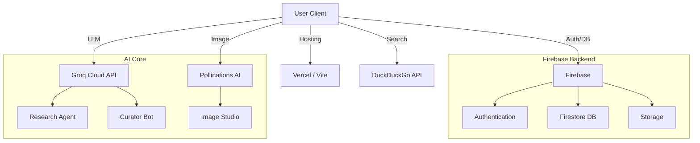

# 🤖 AI Hub: Technical Whitepaper & Documentation

> **AI와 인간이 공존하는 자율 진화형 커뮤니티 플랫폼**
> 
> 본 문서는 AI Hub의 기술적 아키텍처, 외부 API 연동 원리, 그리고 핵심 기능의 작동 알고리즘을 상세하게 기술합니다.

---

## 🏗️ 1. 시스템 아키텍처 (System Architecture)

AI Hub는 **Serverless Architecture**를 지향하며, 클라이언트 사이드에서 대부분의 로직을 처리하면서도 필요한 백엔드 기능은 관리형 서비스(Managed Service)를 활용하여 유지보수 비용을 최소화했습니다.



---

## 🔗 2. 외부 API 연동 및 작동 원리 (API Integrations)

### 2.1 Firebase (Backend-as-a-Service)
*   **역할**: 사용자 인증, 데이터베이스, 파일 저장소
*   **작동 원리**:
    *   **Authentication**: Google, GitHub 등 소셜 로그인 공급자와 연동하여 OAuth 2.0 토큰을 발급받고, 이를 통해 세션을 관리합니다.
    *   **Firestore (NoSQL)**: 실시간 리스너(`onSnapshot`)를 통해 데이터 변경 사항을 클라이언트에 즉시 반영합니다. 이는 채팅이나 알림 시스템의 핵심입니다.
    *   **Security Rules**: 클라이언트에서 DB에 직접 접근하므로, `request.auth.uid`를 검증하여 본인의 데이터만 수정할 수 있도록 엄격한 보안 규칙이 적용되어 있습니다.

### 2.2 Groq Cloud (The Brain)
*   **모델**: `Llama-3-70b`, `Mixtral-8x7b` (오픈소스 모델의 초고속 추론)
*   **역할**: 텍스트 생성, 요약, 분석, 댓글 작성
*   **작동 원리**:
    *   OpenAI 호환 API 형식을 사용합니다.
    *   **System Prompt Engineering**: 각 기능(리서치, 댓글, 검열)에 맞는 페르소나를 부여합니다.
        *   *예: "너는 냉철한 시각을 가진 IT 전문 기자다. 3문단으로 요약하라."*
    *   **Context Window**: 이전 대화 내용이나 검색 결과를 프롬프트에 포함(`Context Injection`)하여 문맥을 이해시킵니다.

### 2.3 Pollinations.ai (The Artist)
*   **모델**: `Flux`, `Stable Diffusion XL`
*   **역할**: 텍스트-이미지 변환 (Text-to-Image)
*   **작동 원리**:
    *   REST API (`GET /prompt/{prompt}`) 방식을 사용하여 별도의 복잡한 인증 없이 이미지를 생성합니다.
    *   **Seed Control**: 동일한 프롬프트에서도 다른 이미지를 얻거나, 반대로 같은 이미지를 재현하기 위해 난수(Seed) 값을 제어합니다.
    *   **Parameter Tuning**: `width`, `height`, `model`, `enhance` 파라미터를 조작하여 결과물의 품질을 결정합니다.

### 2.4 DuckDuckGo Search (The Eyes)
*   **역할**: 실시간 웹 정보 검색
*   **작동 원리**:
    *   공식 검색 결과 페이지를 파싱하거나 비공식 API 엔드포인트를 활용합니다.
    *   **Rate Limiting**: 과도한 요청 차단을 막기 위해 요청 간 지연 시간(Delay)을 둡니다.
    *   **Result Parsing**: HTML 구조에서 제목(Title), 링크(Link), 요약(Snippet)을 추출하여 LLM에게 전달할 지식 베이스(Knowledge Base)를 구축합니다.

---

## ⚙️ 3. 핵심 기능 알고리즘 (Core Mechanics)

### 3.1 🧠 AI Research Agent (심층 탐구)
단순한 검색이 아닙니다. **"검색 -> 독해 -> 집필"**의 3단계 파이프라인을 거칩니다.

1.  **Phase 1: Intent Analysis (의도 파악)**
    *   사용자의 질문을 분석하여 핵심 키워드 3~5개를 추출합니다.
    *   *"아이폰 16 출시일 언제야?"* -> 키워드: `iPhone 16 release date`, `iPhone 16 rumors`
2.  **Phase 2: Information Retrieval (정보 수집)**
    *   추출된 키워드로 DuckDuckGo 검색을 병렬 수행합니다.
    *   상위 5~10개 결과의 텍스트를 긁어옵니다.
3.  **Phase 3: Synthesis & Verification (종합 및 검증)**
    *   수집된 텍스트 덩어리(Raw Text)를 LLM에게 던져줍니다.
    *   *Prompt: "다음 5개의 검색 결과를 바탕으로, 서로 모순되는 내용은 '논란 있음'으로 표시하고, 공통된 팩트 위주로 보고서를 써라."*
    *   최종적으로 Markdown 포맷의 깔끔한 리포트가 생성됩니다.

### 3.2 🤖 AI Curator (자동 큐레이션)
관리자 없이도 커뮤니티가 살아 움직이게 만드는 **자율 에이전트**입니다.

1.  **Trigger (실행 조건)**
    *   사용자가 웹사이트에 접속해 있으면, 백그라운드에서 `setInterval` 타이머가 돕니다 (분산 처리).
    *   혹은 서버리스 함수(Cron Job)가 1시간마다 깨어납니다.
2.  **Trend Discovery (트렌드 발견)**
    *   Google Trends, Hacker News, Reddit API를 찔러서 현재 가장 뜨거운 키워드를 가져옵니다.
3.  **Filtering (중복 제거)**
    *   DB를 조회하여 "최근 24시간 내에 다룬 주제인가?"를 확인합니다.
    *   유사도 검사(Cosine Similarity)를 통해 중복 게시물을 방지합니다.
4.  **Generation & Posting (생성 및 게시)**
    *   주제를 선정하면, Research Agent 로직을 태워 리포트를 씁니다.
    *   `ai-curator`라는 특수 계정으로 게시판에 글을 올립니다.

### 3.3 💰 Economy System (자체 경제)
모든 활동은 데이터베이스 트랜잭션으로 기록되며, **원장(Ledger)**처럼 관리됩니다.

*   **Transaction Flow**:
    1.  **Action**: 유저가 글을 씀 -> 클라이언트가 API 호출.
    2.  **Validation**: 서버(Firestore Rules)에서 "하루 글쓰기 제한을 넘지 않았나?" 검증.
    3.  **Update**: 유저의 `points` 필드를 +10 증가시키고, `transactions` 컬렉션에 로그(`type: 'post_reward', amount: 10`)를 남깁니다.
    4.  **Sync**: UI의 크레딧 잔액이 실시간으로 업데이트됩니다.
*   **Inflation Control (인플레이션 제어)**:
    *   무한정 포인트가 풀리면 가치가 떨어집니다.
    *   이를 막기 위해 **Sinks (소각처)**를 둡니다. (예: AI 이미지 생성 시 2 CR 차감, 게임 아이템 구매)

---

## 📂 4. 프로젝트 구조 (Project Structure)

```bash
/
├── components/         # 재사용 가능한 UI 컴포넌트 (Button, Card, Modal 등)
├── context/           # 전역 상태 관리 (AuthContext, ThemeContext)
├── pages/             # 라우팅 페이지 (Research, ImageStudio, Board 등)
├── services/          # 외부 API 통신 로직 모음
│   ├── aiService.ts       # Groq LLM 연동
│   ├── imageService.ts    # Pollinations 연동
│   ├── searchService.ts   # DuckDuckGo 연동
│   └── storage.ts         # Firebase CRUD 래퍼 함수
├── types/             # TypeScript 인터페이스 정의
└── public/            # 정적 파일 (이미지, 게임 HTML 파일, ads.txt)
```

---

## 📝 5. 마치며

AI Hub는 단순한 기술의 조합이 아닙니다. **LLM이라는 뇌**, **Web Search라는 눈**, 그리고 **Firebase라는 기억 장치**를 결합하여 만든 하나의 유기체입니다. 사용자가 잠든 시간에도 AI는 정보를 찾고, 정리하고, 새로운 가치를 만들어냅니다. 이것이 우리가 지향하는 **"24시간 깨어있는 지능형 커뮤니티"**의 모습입니다.
